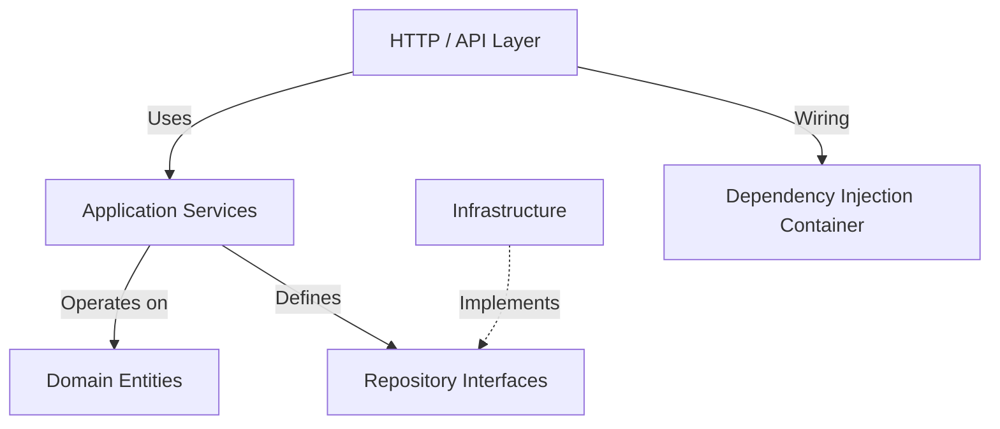

# GhostStack

**Application Dependency Intelligence & Incident Investigation Platform**

> Know what your code can break before you deploy it.

GhostStack observes application telemetry and constructs a live dependency graph to answer critical questions about your infrastructure:

- What depends on this service?
- What is the blast radius if this service fails?
- What happened during an incident, and in what order did failures propagate?
- Which deployment initiated an incident?
- What components may be affected by a proposed deployment?

## Status

🚧 **Under active development** — Local-first backend implementation.

GhostStack is currently implemented entirely with local infrastructure. AWS infrastructure adapters (EventBridge, DynamoDB, CloudWatch) are planned as future replacements for the local infrastructure components to allow deployment to the cloud, but the current setup uses only local tools.

## High-Level Architecture

GhostStack is built using a strict, domain-driven Hexagonal Architecture (Ports and Adapters). This separation ensures business logic remains pure, completely agnostic of databases, HTTP frameworks, or external APIs.



### Layers Explained

- **Domain (`src/domain/`)**: Pure business logic and data structures. Defines `Service`, `Dependency`, `Incident`, `TelemetryEvent`, and `Deployment`. It enforces business rules (like validation and composite unique IDs) without importing *any* external libraries like Express or Mongoose.
- **Application (`src/application/`)**: Orchestrates business use cases. The "brains" of GhostStack (e.g., `DependencyGraphService`, `IncidentDetectionService`, `DemoSimulator`). It operates entirely via Dependency Injection (DI) using Repository Interfaces and never interacts directly with the database.
- **Infrastructure (`src/infrastructure/`)**: Concrete implementations of interfaces defined by the Application layer. Here, Mongoose models interface with MongoDB, and a local EventBus handles pub/sub.
- **HTTP / Interfaces (`src/interfaces/`)**: The presentation layer. Express routes, Zod validators, and controllers. Controllers are thin adapters—they parse incoming HTTP requests, call application services, and format the HTTP responses using standardized contracts.
- **Container (`src/container.js`)**: The Composition Root. It manually instantiates infrastructure dependencies and wires them into application services, which are then passed to controllers. This keeps services highly testable and loosely coupled.

## Tech Stack

- **Runtime:** Node.js (>= 18)
- **Language:** JavaScript
- **Framework:** Express
- **Database:** MongoDB (Mongoose)
- **Validation:** Zod
- **Logging:** Pino
- **Testing:** Vitest + Supertest

## Repository Structure

```
server/
├── src/
│   ├── application/     # Core engines and services (e.g. BlastRadiusService)
│   ├── config/          # Environment configuration
│   ├── domain/          # Pure business entities (database-agnostic)
│   ├── infrastructure/  # MongoDB, event bus implementations
│   ├── interfaces/      # HTTP controllers, routes, middleware
│   └── container.js     # Composition root for DI
├── tests/
│   ├── integration/     # API integration and Repository tests
│   └── unit/            # Isolated unit tests for domain and application
└── server.js            # Entry point
```

## Getting Started

### Prerequisites
- Node.js (v18+)
- MongoDB running locally (default: `mongodb://localhost:27017/ghoststack`)

### Local Setup

1. Clone the repository and navigate to the `server/` directory.
2. Install dependencies:
   ```bash
   npm install
   ```
3. Set up the environment configuration. 
   Create a `.env` file in the `server/src/` directory (or rely on defaults):
   ```env
   PORT=3000
   NODE_ENV=development
   MONGO_URI=mongodb://localhost:27017/ghoststack
   LOG_LEVEL=info
   ```

### Running the Backend

To start the server:
```bash
npm start
```
For development with auto-reload:
```bash
npm run dev
```

### Running Tests

GhostStack has an extensive test suite ensuring architectural integrity and business rule validity.
```bash
# Run all tests
npm test

# Run only unit tests
npm run test:unit

# Run only integration tests
npm run test:int
```

## Demo Simulator

GhostStack includes a deterministic Demo Simulator built directly into the application layer. It simulates a microservice topology and generates realistic telemetry events, deployments, and cascading failures to demonstrate the platform's capabilities.

**Topology:**
- `frontend` → `api-gateway`
- `api-gateway` → `auth-service`, `checkout-service`, `analytics-service`
- `checkout-service` → `payment-service`, `orders-service`
- `payment-service` → `external-payment-provider`
- `orders-service` → `mongodb`, `notification-service`

### Demo Scenarios

1. **`normal-traffic`**: Generates healthy telemetry (200 OK, low latency) across all services, building the dependency graph.
2. **`payment-deployment`**: Simulates a deployment of `payment-service` and returns deterministic impact analysis.
3. **`payment-latency`**: Simulates high latency in `payment-service`, showing downstream impact on `checkout-service` and providing blast radius analysis.
4. **`payment-failure`**: Simulates failures (500 Internal Server Error) in `payment-service` causing a >50% error rate, triggering an automated incident detection.
5. **`complete-incident`**: The full cascade deterministic scenario:
   `deployment` → `latency` → `failures` → `downstream impact` → `incident detection`.

### Example Demo Flow

1. Reset the database:
   ```bash
   curl -X POST http://localhost:3000/api/demo/reset
   ```
2. Trigger the complete incident cascade:
   ```bash
   curl -X POST http://localhost:3000/api/demo/scenarios/complete-incident
   ```
   *The response will include the processed events, the deployment record, the detected incident, and the calculated blast radius.*

3. Query the dependency graph to see what broke:
   ```bash
   curl http://localhost:3000/api/dependencies/graph
   ```

## API Reference

### Response Contracts

**Success Envelope (2xx)**
```json
{
  "success": true,
  "data": { ... },
  "meta": {
    "timestamp": "2026-01-15T10:00:00.000Z"
  }
}
```

**Error Envelope (4xx, 5xx)**
```json
{
  "success": false,
  "error": {
    "code": "VALIDATION_ERROR",
    "message": "Invalid payload"
  }
}
```

### Endpoints

#### Projects & Developer API Keys
- `POST /api/projects` - Create a new project namespace (generates URL slug).
- `GET /api/projects` - List all projects (supports `?status=active|archived`).
- `GET /api/projects/:projectId` - Get project details.
- `POST /api/projects/:projectId/archive` - Archive a project (immediately blocks new telemetry ingestion).
- `POST /api/projects/:projectId/keys` - Generate a new ingestion API key (`gs_live_...`). **Returns the plaintext secret strictly once.** Only the SHA-256 hash is persisted.
- `GET /api/projects/:projectId/keys` - List safe key metadata (`prefix`, `permissions`, `createdAt`, `revokedAt`). Plaintext and hash are never returned.
- `POST /api/projects/:projectId/keys/:keyId/revoke` - Revoke an API key immediately.

#### Telemetry
- `POST /api/telemetry` - Ingest a single telemetry event. Requires `X-GhostStack-Key` or `Authorization: Bearer <key>` header.
- `POST /api/telemetry/batch` - Ingest an array of telemetry events. Requires authenticated API key.

#### Services & Dependencies
- `GET /api/services` - List all discovered services.
- `GET /api/services/:id` - Get a specific service by ID.
- `GET /api/dependencies` - List all service dependencies.
- `GET /api/dependencies/graph` - Get the complete dependency graph and statistics.
- `GET /api/blast-radius/:serviceId` - Calculate the blast radius of a failing service.

#### Deployments & Change Correlation
- `POST /api/projects/:projectId/deployments` - Record a deployment scoped to a project. Supports initial deployments (`previousVersion: null`).
- `GET /api/projects/:projectId/deployments` - List deployments for a project with optional filters (`serviceId`, `environment`, `startTime`, `endTime`, `limit`).
- `GET /api/projects/:projectId/deployments/:deploymentId` - Get a single deployment detail.
- `GET /api/projects/:projectId/incidents/:incidentId/correlations` - Correlate deployments within a 30-minute window of incident start, classifying direct, upstream, and downstream changes with structured evidence.
- `POST /api/deployments` - Legacy/default deployment endpoint (records to `project-default`).
- `POST /api/deployments/analyze` - Analyze the potential impact of a proposed deployment.

#### Incidents & Continuous Intelligence
- `GET /api/projects/:projectId/incidents` - List incidents scoped to a project (supports `?environment=...&status=...&severity=...&limit=...`).
- `GET /api/projects/:projectId/incidents/:id` - Get single incident details scoped to project.
- `GET /api/projects/:projectId/incidents/:id/replay` - Chronological incident timeline replay with millisecond offsets (`relativeTimeMs`).
- `POST /api/projects/:projectId/incidents/detect` - Trigger detection evaluation scoped specifically to project telemetry.
- `GET /api/incidents` - Global incident listing (legacy / dashboard).
- `GET /api/incidents/:id` - Global incident details.
- `GET /api/incidents/:id/replay` - Global incident timeline replay.
- `POST /api/incidents/detect` - Global manual trigger for incident detection against recent telemetry.

##### Continuous Detection & Intelligence Engine
- **Event-Driven Architecture**: The `IncidentDetectionService` subscribes to `telemetry.processed` events on the in-process `LocalEventBus`. Every ingested telemetry event immediately evaluates for anomaly creation, active incident updates, or auto-resolution.
- **Configurable Detection Policy (`IncidentDetectionPolicy`)**: Evaluates anomalies using configurable rolling time windows (`timeWindowMs`), sample size minimums (`minimumEvents`), error rate thresholds (`errorRateThreshold`), and latency limits (`latencyThresholdMs`).
- **Continuous Deduplication**: Ongoing failures for the same `(projectId, environment, service)` continuously update the active incident's severity, trigger statistics, and timeline rather than creating noisy duplicate incident records.
- **Timeline Idempotency**: Duplicate telemetry deliveries (same `eventId`) are detected and skipped in the timeline, preventing timeline bloat.
- **Auto-Resolution on Metric Recovery**: When error rates drop below `recoveryErrorRateThreshold` and latency drops below `recoveryLatencyThresholdMs` across `minimumRecoveryEvents` within `recoveryObservationWindowMs`, active incidents automatically transition to `resolved` with an `endedAt` timestamp.
- **Terminal Resolution Invariant**: `resolved` is a strictly terminal state. Resolved incidents are NEVER reopened; any future anomaly creates a fresh incident entity with its own lifecycle.
- **Tenant & Environment Isolation**: Incidents and timeline events are strictly isolated by `projectId` and `environment`. Telemetry in staging never contaminates production incidents.

#### Demo Simulator
- `GET /api/demo/scenarios` - List available demo scenarios.
- `POST /api/demo/scenarios/:scenario` - Execute a specific demo scenario.
- `POST /api/demo/start` - Alias to run the `complete-incident` scenario.
- `POST /api/demo/reset` - Clear demo data (scoped strictly to `project-demo`).

#### System
- `GET /api/health` - Basic health check.
